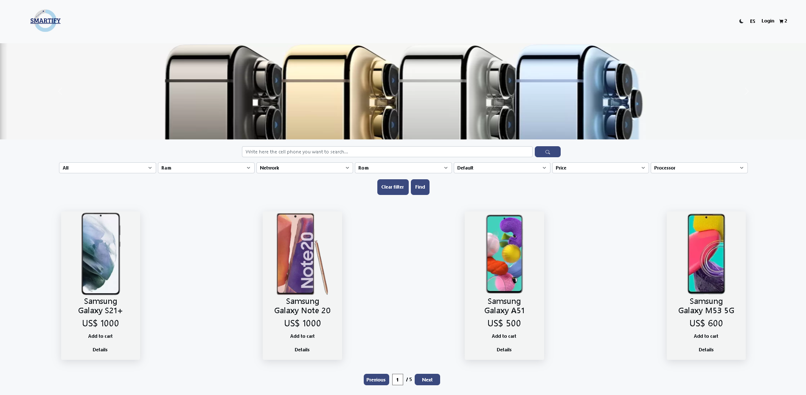
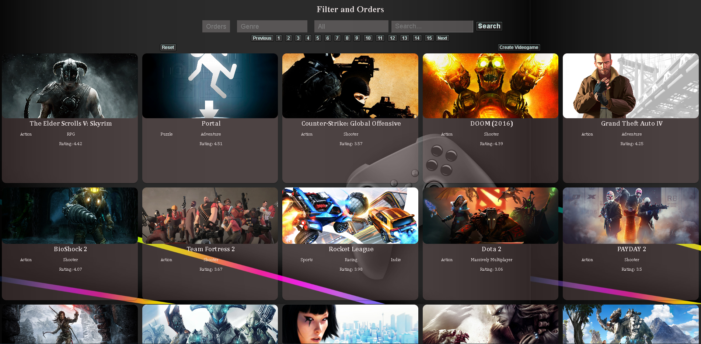
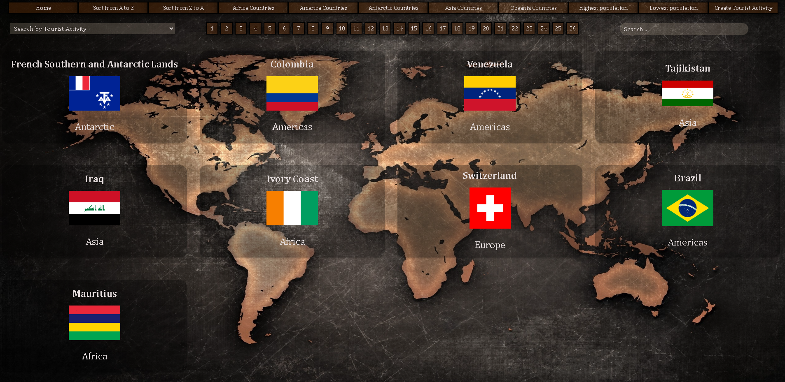

My name is Andrés Capano and I am a Software Developer recently graduated from Henry's Bootcamp with Front-End orientation and eager to keep learning about new technologies and meet new people related to this world!

 

⚫ Skills :

 

· ⦿ Teamwork

· ⦿ Problem solving

· ⦿ Comunication

· ⦿ Analytical skills

⚫ I feel comfortable working with :

 

· ⦿ Semantic HTML5

· ⦿ Advanced CSS3

· ⦿ GIT

· ⦿ Javascript ES6+

· ⦿ React

· ⦿ Redux

· ⦿ Next

· ⦿ Server side rendering

· ⦿ Postman

· ⦿ Node

· ⦿ Express

· ⦿ Firebase

· ⦿ Sequalize

· ⦿ Vercel

· ⦿ Heroku

· ⦿ Scrum

· ⦿ Trello

📌 My proyects

 

